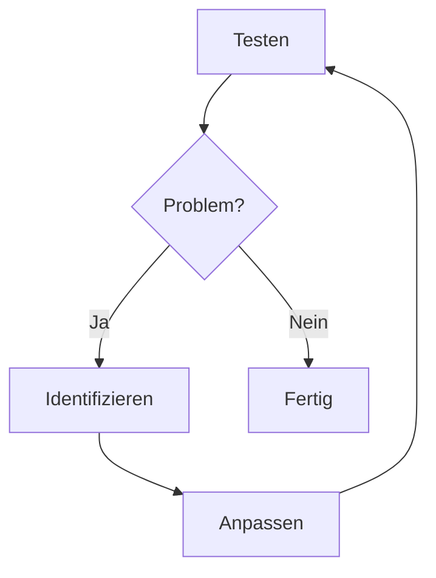

<div class="absolute bottom-10">
  <h1>KI Skills Development</h1>
  <p class="text-lg opacity-80">Systematisch KI-Expertise aufbauen — von der Idee bis zur Publikation</p>
  <p class="text-sm opacity-50 mt-4">Roman Mesicek · 9. Februar 2026</p>
</div>

<div class="absolute bottom-2 right-4 text-[10px] opacity-30">
  <a href="https://unsplash.com/@productschool">Product School</a> (Unsplash)
</div>

<!--
Willkommen zum Workshop. Heute zeigen wir, wie man Claude Skills systematisch entwickelt — nicht durch Prompten, sondern durch strukturierte Wissensarbeit.
-->

---
layout: section
---

# Live Recherche
## Wir starten gemeinsam

<!--
Bevor wir in die Theorie gehen, starten wir mit einer gemeinsamen Recherche. Überlegt Euch ein Unternehmen, über das ihr mehr wissen möchtet - zum Thema Nachhaltiugkeit, ESG oder CSR und nutzt die KI um das herauszufinden. Gerne Parallel zu meinem Vortrag.
-->

---
layout: statement
---

# Was ist ein Skill?

Ein **Skill** erweitert ein Large-Language-Modell (LLM) um spezialisiertes Wissen und strukturierte Workflows.

<div class="mt-8 grid grid-cols-2 gap-6 text-left">
<div>

### Skills können...

- Komplexe Aufgaben in **wiederholbare Workflows** strukturieren
- Fachspezifisches Wissen bereitstellen
- **Output-Formate** und Qualitätskriterien vorgeben
- Durch Trigger-Phrases automatisch aktiviert werden
</div>
<div>

### Technisch gesehen...

- Markdown-Dateien (`.md`)
- Referenzdokumente als Wissensbasis
- Lokal oder via GitHub teilbar
</div>
</div>

<!--
Ein Skill ist kein Prompt. Es ist eine dokumentierte Expertise, die Claude reproduzierbar abrufen kann. Denkt an ein Fachbuch, das Claude für eine bestimmte Aufgabe liest.
-->

---
layout: section
---

# Der Workflow
## 7 Phasen zur Skill-Entwicklung

<!--
Der Workflow besteht aus 7 Phasen. Wir gehen jede einzeln durch — mit einem durchgängigen Beispiel.
-->

---

# Workflow-Übersicht

<div class="grid grid-cols-4 gap-4 mt-2">
  <div class="p-3 rounded-lg text-center text-sm font-bold" style="background:#e1f5fe;border:2px solid #0288d1">1. Framework</div>
  <div class="p-3 rounded-lg text-center text-sm font-bold" style="background:#f3e5f5;border:2px solid #7b1fa2">2. Sammlung</div>
  <div class="p-3 rounded-lg text-center text-sm font-bold" style="background:#e8f5e9;border:2px solid #388e3c">3. Recherche</div>
  <div class="p-3 rounded-lg text-center text-sm font-bold" style="background:#fff3e0;border:2px solid #f57c00">4. Erstellen</div>
</div>

<div class="flex justify-center my-2">
  <span class="text-2xl opacity-50">↓</span>
</div>

<div class="grid grid-cols-4 gap-4">
  <div class="col-start-2 p-3 rounded-lg text-center text-sm font-bold" style="background:#fce4ec;border:2px solid #c62828">5. Testen</div>
  <div class="p-3 rounded-lg text-center text-sm font-bold" style="background:#f5f5f5;border:2px solid #616161">6. Iterieren</div>
  <div class="p-3 rounded-lg text-center text-sm font-bold" style="background:#e0f2f1;border:2px solid #00695c">7. Publizieren</div>
</div>

<div class="flex justify-center mt-1">
  <span class="text-xs opacity-50">↻ Anpassen zwischen Testen & Iterieren</span>
</div>

<div class="mt-6 text-center opacity-70">

**Der Kern:** Gute Skills entstehen durch systematische Wissensarbeit — Framework wählen, dokumentieren, testen, iterieren.

</div>

<!--
Hier seht ihr den Gesamtüberblick. Beachtet die Rückkopplungsschleife zwischen Testen und Iterieren — das ist der entscheidende Teil.
-->

---
layout: intro-image
image: /images/blueprint.jpg
---

<div class="absolute bottom-10">
  <span class="text-sm font-bold tracking-widest uppercase opacity-60">Phase 1–2</span>
  <h1>Grundlagen & Wissenssammlung</h1>
  <p class="text-lg opacity-80">Framework finden und Referenzdokumente aufbauen</p>
</div>

<div class="absolute bottom-2 right-4 text-[10px] opacity-30">
  <a href="https://unsplash.com/@communityarchives">Community Archives</a> (Unsplash)
</div>

<!--
Bevor Code geschrieben wird, steht die Frage: Welche Methodik existiert bereits? Wir erfinden das Rad nicht neu.
-->

---

# Phase 1: Framework finden

Bevor ein Skill entsteht, braucht er ein **solides theoretisches Fundament**.

| Schritt | Frage | Output |
|---------|-------|--------|
| Problemstellung | Was genau soll der Skill lösen? | Problem Statement |
| Framework-Recherche | Welche Methoden existieren bereits? | Kandidaten |
| Framework-Auswahl | Akademisch fundiert und praxistauglich? | Ausgewähltes Framework |
| Dokumentation | Wie lässt es sich strukturiert erfassen? | `framework.md` |

<div class="mt-6 p-4 bg-blue-50 rounded-lg border border-blue-200">

**Beispiel ESG-Maturity Skill:** Das **Ainsbury-Grayson 5-Stufen-Modell** wurde als Framework gewählt — ein akademisch fundiertes Modell mit 11 Bewertungskategorien. Die Framework-Dokumentation umfasst 41 KB. <span class="text-xs opacity-60">[ESG Maturity Agent, Proof of Cconcept (Github)](https://github.com/romanmesicek/esg-maturity-agent)</span>

</div>

<!--
Beim ESG-Maturity Skill haben wir das Ainsbury-Grayson Modell gewählt. 5 Reifegrade, 11 Kategorien — alles akademisch fundiert.
-->

---

# Phase 2: Wissenssammlung

Ein Skill ist nur so gut wie sein Wissen. Alles wird in **Referenzdokumenten** erfasst.

<div class="grid grid-cols-2 gap-6 mt-6">

<div class="p-4 bg-gray-50 rounded-lg">

### Framework
Die methodische Grundlage: Bewertungsmodell, Prozessschritte

</div>

<div class="p-4 bg-gray-50 rounded-lg">

### Source Types
Welche Eingaben gibt es? Quellenarten, Datenformate

</div>

<div class="p-4 bg-gray-50 rounded-lg">

### Edge Cases
Was sind die Sonderfälle? Ausnahmen, Grenzfälle

</div>

<div class="p-4 bg-gray-50 rounded-lg">

### Error Patterns
Was geht häufig schief? Typische Fehler mit Korrekturen

</div>

</div>

<div class="mt-4 text-sm opacity-70">

**Best Practice:** Jedes Referenzdokument sollte eigenständig aktualisierbar sein, ohne die Kern-Skill-Logik zu ändern.

</div>

<!--
Modularität ist hier der Schlüssel. Die Referenzdokumente sind unabhängig vom Skill selbst. Das erlaubt Updates ohne den Kern anzufassen.
-->

---
layout: intro-image
image: /images/books-research.jpg
---

<div class="absolute bottom-10">
  <span class="text-sm font-bold tracking-widest uppercase opacity-60">Phase 3–4</span>
  <h1>Recherche & Skill erstellen</h1>
  <p class="text-lg opacity-80">Systematisch recherchieren und in eine klare Struktur überführen</p>
</div>

<div class="absolute bottom-2 right-4 text-[10px] opacity-30">
  <a href="https://unsplash.com/@brett_jordan">Brett Jordan</a> (Unsplash)
</div>

<!--
Gute Skills basieren auf verlässlichen Quellen. Hier wird systematisch recherchiert.
-->

---

# Phase 3: Quellen-Hierarchie

Nicht alle Quellen sind gleich. Eine klare Priorisierung hilft bei der Bewertung.

<div class="grid grid-cols-2 gap-x-8 mt-4">
<div>

**Höchste Vertrauenswürdigkeit**
- Peer-reviewed Journals
- Institutionelle Berichte
- Regierungsquellen

</div>
<div>

**Eingeschränkte Vertrauenswürdigkeit**
- Branchenreports *(Mittel)*
- Nachrichtenmedien *(Niedrig)*
- Allgemeine Webquellen *(Prüfen)*

</div>
</div>

**Qualitätsmarker:** `[UNVERIFIED]` · `[CONFLICTING]` · `[INDUSTRY SOURCE]` · `[PREPRINT]` · `[OUTDATED]` <span class="text-xs opacity-60">[Academic-Research Skill (GitHub)](https://github.com/romanmesicek/agent-skills)</span>

<!--
Der ESG-Maturity Skill basiert auf 47+ akademischen Quellen aus den Jahren 2014–2026. Jede Quelle ist nach dieser Hierarchie eingestuft.
-->

---

# Phase 4: Skill erstellen

Das gesammelte Wissen wird in eine **klare Dateistruktur** überführt.

<div class="grid grid-cols-2 gap-8 mt-6">
<div>

### Dateistruktur

```
skill-name/
├── SKILL.md            # Instruktionen
├── references/
│   ├── framework.md
│   ├── edge-cases.md
│   └── common-errors.md
└── assets/
    └── template.html
```

</div>
<div>

### SKILL.md Aufbau

```yaml
---
name: skill-name
description: Was der Skill macht
triggers:
  - "trigger phrase 1"
  - "trigger phrase 2"
---
```

| Komplexität | Phasen | Umfang |
|-------------|--------|--------|
| Einfach | 3–4 | 50–100 Zeilen |
| Mittel | 4–5 | 100–200 Zeilen |
| Komplex | 5–6 | 200–300 Zeilen |

</div>
</div>

<!--
Die SKILL.md ist das Herzstück. Sie enthält den Workflow, das Output-Format und verweist auf die Referenzdokumente.
-->

---
layout: intro-image
image: /images/whiteboard-iteration.jpg
---

<div class="absolute bottom-10 text-black">
  <span class="text-sm font-bold tracking-widest uppercase opacity-60">Phase 5–7</span>
  <h1 class="!text-black">Testen, Iterieren & Publizieren</h1>
  <p class="text-lg opacity-70">Lokal validieren, verfeinern und veröffentlichen</p>
</div>

<div class="absolute bottom-2 right-4 text-[10px] opacity-30 text-black">
  <a href="https://unsplash.com/@plhnk">Paul Hanaoka</a> (Unsplash)
</div>

<!--
Jetzt wird es praktisch. Der Skill wird lokal installiert und in echten Szenarien getestet.
-->

---

# Phase 5: Testen

Den Skill lokal installieren und in der Praxis validieren.

<div class="grid grid-cols-2 gap-8 mt-4">
<div>

### Installation

```bash
# Skill lokal verlinken
ln -s "/pfad/zu/skill" ~/.claude/skills/skill

# Oder direkt entwickeln in
~/.claude/skills/skill-name/
```

</div>
<div>

### Test-Checkliste

- Trigger-Phrases aktivieren zuverlässig
- Workflow-Phasen werden vollständig durchlaufen
- Output entspricht dem definierten Format
- Edge Cases werden korrekt behandelt
- Fehlermeldungen sind verständlich

</div>
</div>

<!--
Jetzt wird es praktisch. Der Skill wird lokal installiert und in echten Szenarien getestet.
-->

---

# Phase 6: Iterieren

Basierend auf Tests verfeinern — oft 3–5 Runden.

<div class="grid grid-cols-2 gap-8 mt-4">
<div>



</div>
<div>

### Häufige Anpassungen

- Referenzdokumente erweitern oder präzisieren
- Workflow-Schritte klarer formulieren
- Trigger-Phrases ergänzen für bessere Erkennung
- Edge Cases hinzufügen, die im Test auffielen

</div>
</div>

<!--
Der Iterationszyklus ist der wichtigste Teil. Hier werden die meisten Verbesserungen gemacht.
-->

---

# Phase 7: Publizieren

Den Skill für andere verfügbar machen.

| Methode | Zielgruppe | Aufwand |
|---------|------------|--------|
| **Lokal** | Nur eigene Nutzung | Gering |
| **Team-Share** | Kolleg:innen | Mittel |
| **GitHub** | Öffentlich | Höher |

### Installation für Nutzer

```bash
npx skills add username/repo --skill skill-name
```

**Tipp:** Auf [skills.sh](https://skills.sh) finden sich bereits veröffentlichte Skills als Inspiration und zur direkten Installation.

<!--
Die Publikation auf GitHub macht den Skill für die Community verfügbar. Ein einfacher npx-Befehl genügt zur Installation. skills.sh ist die zentrale Anlaufstelle für veröffentlichte Skills.
-->

---
layout: section
---

# Live Demo
## ESG Maturity Agent in Aktion

<!--
Jetzt zeigen wir den ESG-Maturity Skill live. Wir analysieren ein Unternehmen und sehen, was der Skill produziert.
-->

---

# Qualitätskriterien

Was macht einen guten Skill aus?

| Kriterium | Beschreibung | Indikator |
|-----------|--------------|-----------|
| **Fundierung** | Basiert auf etablierten Methoden | Referenzierte Frameworks/Standards |
| **Dokumentation** | Umfassende Referenzdokumente | Abdeckung aller Anwendungsfälle |
| **Modularität** | Komponenten einzeln aktualisierbar | Getrennte Reference-Files |
| **Transparenz** | Umgang mit Unsicherheiten | Qualitätsmarker, Quellenangaben |
| **Testabdeckung** | Edge Cases berücksichtigt | Dokumentierte Sonderfälle |

<!--
Diese fünf Kriterien helfen bei der Selbstevaluation. Fundierung und Transparenz sind die wichtigsten.
-->

---

# Kontakt

<div class="grid grid-cols-2 gap-12 mt-8">
<div>

## Roman Mesicek

<div class="mt-6 space-y-3">

**Email:** roman.mesicek@36sustainability.org

**LinkedIn:** [/in/romanmesicek](https://www.linkedin.com/in/romanmesicek/)

**GitHub:** [github.com/romanmesicek](https://github.com/romanmesicek)

</div>

</div>
</div>

<!--
Vielen Dank! Bei Fragen oder Interesse an einem Follow-up Workshop, meldet euch gerne.
-->
